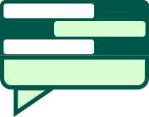

  
  <h1>WhatsApp Reader - Next.js</h1>
  
  
  

  
When you export your WA chat, turns chaotic read the conversations WA Reader gives the format to the conversations and shows like the original chat.

